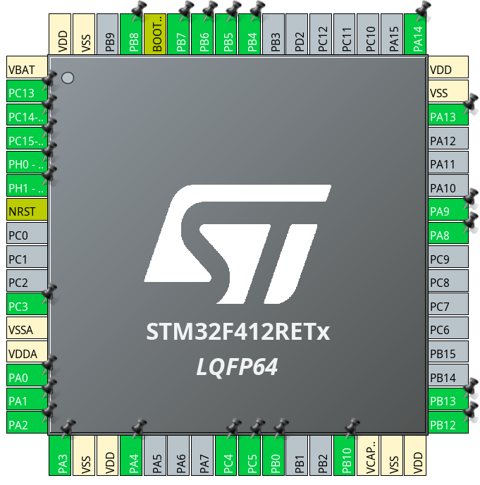

# STM32 Switch Table for SZEmission

The switch table is the "brain" of the car, used for controlling functions like lights, wiper, brake and acceleration. It processes the inputs from the switches, steering wheel and throttle pedal then compiles them into it's state message and sends that out over CAN.

## Features

1. **State Broadcasting**: Sends a CAN message every 50ms about its own state (switch positions, throttle position)
2. **Wiper Control**: Controls the wiper's DC-DC converter and servo with PWM
3. **Throttle Input**: Reads and filters the analog potentiometer connected to the throttle pedal
4. **Motor Control**: Optionally sends throttle reference commands to the motor controller over CAN

## Hardware

### First prototype

Nucleo C092RC Development Board

- **Microcontroller**: STM32C092RCTx (LQFP64)
- **Clock**: Internal HSI oscillator running at 48MHz
- **CAN Interface**: FDCAN1 using the on-board CAN transceiver
- **Programmer/Debugger**: Nucleo built-in ST-Link

### Deployment

Custom board: "Switch Table v4"

- **Microcontroller**: STM32F412RET6 (LQFP64)
- **Clock**: 8MHz external crystal, HSE
- **CAN Interface**: CAN2 using an ESDCAN24-2BLY transceiver
- **Programmer/Debugger**: External ST-Link programmer

## MCU Peripherals Used

This project uses 4 types of peripherals to achive it's functionality:

### CAN bus

The CAN2 peripheral is used for CAN communication on the pins PB12 and PB13.

The messages used are the following:

| Direction | ID    | Name           | Description                                           |
|-----------|-------|----------------|-------------------------------------------------------|
| Received  | 0x190 | Steering_Wheel | Button and switch information from the steering wheel |
| Received  | 0x123 | Encoder        | Wheel RPM measurement from the encoder                |
| Sent      | 0x129 | VCU_State      | Switch positions and filtered throttle                |
| Sent      | 0xA51 | MC_Command     | Torque reference for the motor controller             |

#### Steering Wheel State (0x190)

```
Byte 0 (STW_STATE_A):
  Bit 0: ACC (Cruise Control Activate)
  Bit 1: DRIVE (Drive Mode)
  Bit 2: REVERSE (Reverse Mode)
  Bit 3: LAP (Lap timing signal)
  Bit 4: TS_L (Traction Control Left)
  Bit 5: TS_R (Traction Control Right)
  Bit 6: FUNCTION1 (Reserved)
  Bit 7: FUNCTION2 (Reserved)

Bytes 1-3: Position of the 3 switches on the steering wheel (STW_STATE_B/C/D)
```

#### VCU State (0x129)

```
Byte 0 (VCU_STATE_A):
  Bit 0: HEADLIGHT
  Bit 1: HAZARD
  Bit 2: AUTO
  Bit 3: BRAKE
  Bit 4: LIGHTS_ENABLE
  Bit 5: MC_OW (Motor Control Override)
  Bit 6: WIPER
  Bit 7: Reserved

Byte 1 (VCU_STATE_B):
  Bit 0: RELAY_NO
  Bit 1: RELAY_NC
  Bits 2-7: Reserved
```

### Timers

- TIM2 is used to trigger the ADC
- TIM3 is for PWM generation to the wiper, on it's CH1 output (pin PB4)
- TIM14 is the tick timer that fires every 50ms to wake up the CPU

### Analog to digital

ADC1 with IN0 on pin PA0 is used to read the throttle pedal position. It is started in DMA mode with the TIM2 timer triggering it every 5ms. It writes the conversions to the `throttle_adc_buffer` variable.

### UART

This is only used for debugging purposes. In the `user.h` file, its possible to set what debug outputs the MCU sends over UART.

## Pin Configuration



| Function                     | Name                         | Pin  | Type         |
| ---------------------------- | ---------------------------- | ---- | ------------ |
| Switch used to enable lights | Lights_enable_switch         | PC3  | GPIO Input   |
| Wiper on/off                 | Wiper_switch                 | PB0  | GPIO Input   |
| Hazard signal                | Hazard_switch                | PB5  | GPIO Input   |
| Autonomous mode switch       | Autonomous_switch            | PC4  | GPIO Input   |
| Motor control override       | Motorcontrol_override_switch | PC5  | GPIO Input   |
| Headlight switch             | Headlight_switch             | PC13 | GPIO Input   |
| Brake pedal input            | Brake_pedal_input            | PA9  | GPIO Input   |
| Brake pedal input            | Clutch_pedal_input           | PA8  | GPIO Input   |
| Wiper converter enable       | OUT_WIPER_CONVERTER          | PD3  | GPIO Output  |
| Throttle Potentiometer       | Throttle_pedal_ADC           | PA0  | ADC Input    |
| Wiper Servo Control          | Wiper_PWM                    | PB4  | TIM3 PWM CH1 |
| Yellow debug LED             | LED1_Yellow                  | PA1  | GPIO Output  |
| Red error LED                | LED2_Red                     | PA2  | GPIO Output  |
| Green status LED             | LED3_Green                   | PA3  | GPIO Output  |
| Blue debug LED               | LED4_Blue                    | PA4  | GPIO Output  |
| CAN Receive                  | CAN2_RX                      | PB12 | CAN2_RX      |
| CAN Transmit                 | CAN2_TX                      | PB13 | CAN2_TX      |
| UART Receive                 | USART1_RX                    | PB7  | USART1_RX    |
| UART Receive                 | USART1_TX                    | PB6  | USART1_TX    |

## Code Structure

This code is designed to minimize the amount of user code in generated files. The main working logic is in `user.c` and `user.h`. Another key factor is limiting power consumption, which means also limiting CPU time.

### Directory Breakdown

```
sw_table_stm32/
├── sw_table_stm32.ioc            # STM32CubeIDE pin/peripheral configuration
├── sw_table_stm32.pdf            # Auto-generated hardware pinout diagram
├── Core/
│   ├── Inc/
│   │   ├── main.h               # Generated header, contains the pin definitions
│   │   └── user.h               # User-defined functions and structures
│   ├── Src/
│   │   ├── main.c               # Main entry point and peripheral initialization
│   │   └── user.c               # User-defined functions, main controller logic
```

### Key Files

- **main.c**: System initialization, timer setup, interrupt handlers and main function (entry point)
- **user.c**: Core application logic including CAN communication, GPIO control, and throttle processing
- **user.h**: Data structures, function declarations and constant definitions

## Development Guidelines

- **Use fixed-point math** instead of floating-point where possible because its faster
- **Keep ISRs short**: Set flags and do the actual processing in main loop
- **Power efficiency is key**: Try to use DMA and other hardware logic to limit CPU usage as much as possible

---

### Authors

Created by **SZEnergy Team** for Shell Eco Marathon

- **Váradi Marcell** (varma02@GitHub)

### License

This project is licensed under the MIT License - see the [license](license) file for details.
